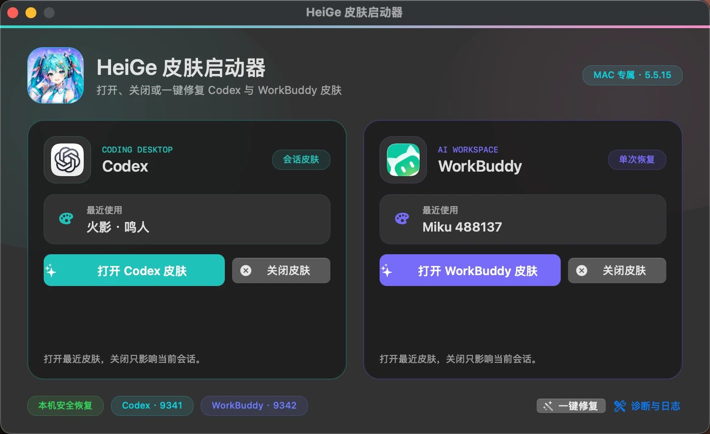
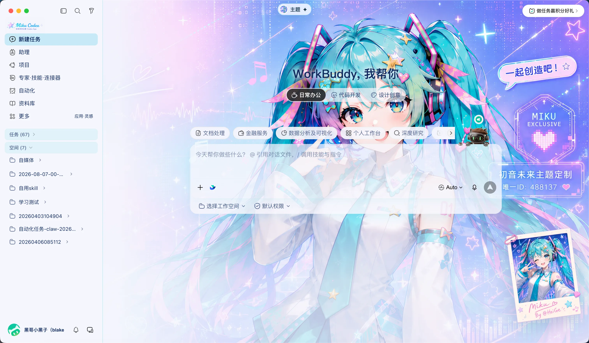

# HeiGe Codex Skin Studio | Codex 换肤工作室

<div align="center">

**写代码的地方，也该是你喜欢的样子。**

一张图片就是一套主题。装好之后，换肤只是顶部菜单里的一次点击，随时一键还原官方界面。

*Reskin OpenAI Codex Desktop with one image. Native controls stay fully interactive.*

[](LICENSE)


[快速开始](#快速开始macos) · [做你自己的主题](#用一张图做你自己的主题) · [晒图区](https://github.com/HeiGeAi/heige-codex-skin-studio/discussions) · [完整手册](docs/manual.md) · [English](README.en.md) · [官网](https://www.heigeai.com/codexskin/)

出品：公众号「黑哥Ai」 · 短视频「黑哥AI实验室」 · 更多开源见 [HeiGeAi 组织主页](https://github.com/HeiGeAi)

</div>

## 赞助与推荐

<table>
  <tr>
    <td width="190" align="center">
      <a href="https://heyroute.ai/vip" target="_blank" rel="noopener noreferrer">
        
      </a>
    </td>
    <td>
      <strong>HeyRoute｜AI 编程与多模态 API 入口</strong><br><br>
      💻&nbsp;<strong>AI 编程接入：</strong>一个 API Key 可接入 Codex、Claude Code、Cursor 及 OpenAI 兼容客户端，替换 Base URL 即可开始。<br>
      🎨&nbsp;<strong>多模态创作：</strong>支持语言模型、AI 生图、生视频和图像编辑，适合内容创作、应用开发与 Agent 工作流。<br>
      🧠&nbsp;<strong>多模型入口：</strong>覆盖 OpenAI、Claude、Gemini、Grok、DeepSeek、Kimi、Qwen、GLM 等模型系列，具体可用模型以平台实时页面为准。<br>
      📊&nbsp;<strong>调用记录可查：</strong>统一管理 API Key、用量与调用记录，方便测试不同模型并核对实际消耗。<br>
      🎁&nbsp;<strong>注册福利：</strong>通过 <a href="https://heyroute.ai/vip" target="_blank" rel="noopener noreferrer"><strong>专属注册链接</strong></a> 完成注册，即送 <strong>US$15 试用额度</strong>。先跑通真实任务，再决定是否充值。
    </td>
  </tr>
</table>

> ## 🆕 5.5.15 更新：Mac 专属双产品皮肤启动器
>
> macOS 安装后会得到独立的「HeiGe 皮肤启动器」。它能分别打开或关闭 Codex、WorkBuddy 的当前皮肤，并提供一键修复和诊断日志入口。电脑重启、客户端更新或皮肤意外丢失后，无需重新执行命令，点击启动器即可恢复最近使用的皮肤。
>
> 本版同时集中修复 WorkBuddy 的透明浮层问题。权限确认、任务归档、专家召唤等同源对话框恢复不透明主题底色，并补齐文件管理下拉菜单的实底保护。



*5.5.15 真机截图：Codex 与 WorkBuddy 独立控制，支持打开皮肤、关闭皮肤、一键修复和诊断日志，夜间模式保持清晰可读。*

> ## 🆕 重大升级：现已支持国产 AI 编程工具 WorkBuddy
>
> 同一套引擎，现在也能给腾讯 CodeBuddy 桌面端（WorkBuddy）换肤。一次性皮肤、即点即换、一键还原原生界面，用法见 [WorkBuddy 章节](#workbuddy腾讯-codebuddy-桌面端)。



*真机截图：WorkBuddy 5.3.11 换上 Miku 488137 主题，顶部中间同样是「主题」入口，主题中心即点即换。*


*真机截图：Miku 488137 高精度主题，顶部中间的「主题」入口直接打开主题中心。*


*真机截图：主题中心。当前主题、自定义图片、原生界面、内置主题预览、阅读增强和皮肤常驻开关都在一屏里，主题卡片即点即换。*

## 它长这样

下面全部是真机截图，侧栏、输入框、建议卡都是 Codex 原生控件，可以正常点。

| 鸣潮 | 原神 · 星夜 |
| --- | --- |
|  |  |

| 原神 · 破晓 | 大佬 · 点烟 |
| --- | --- |
|  |  |

## Windows 版

Windows 11 版本现已发布：[查看最新 Release](https://github.com/HeiGeAi/heige-codex-skin-studio/releases/latest)。

- Windows 安装与恢复：使用 scripts\windows\install.bat / apply.bat，不修改 app.asar、应用二进制或签名资源。
- 随 Windows 登录启动：开启「皮肤常驻」后会为当前用户注册登录计划任务，无需再次运行安装脚本。首次启用后请重启 Windows 或注销后重新登录一次；后台皮肤控制器将随登录启动，并在随后普通启动 Codex 时恢复主题与顶部入口。
- 隐藏按钮：顶部主题入口可选择「隐藏此按钮」，收起为小圆点；点击即可恢复，状态会保存。
- 随机主题：提供持久化的随机主题开关，随机选择主题并尽量避免连续重复。

> Microsoft Store/MSIX 客户端仍需真机验证。商店版若报回环隔离，可先运行 `scripts\windows\enable-loopback.bat`（一次管理员权限）再重试 apply；自动接管在端口仍不可达时无法完成。

## WorkBuddy（腾讯 CodeBuddy 桌面端）

同一套引擎也能给 WorkBuddy 换肤，走本机回环 CDP（`127.0.0.1:9342`，与 Codex 的 9341 互不干扰），同样不修改 `app.asar`：

```bash
"<仓库路径>/scripts/workbuddy-apply.command" --restart
```

应用后 WorkBuddy 顶部出现 🎨 主题中心，内置主题即点即换；还原运行 `scripts/workbuddy-restore.command`。三点实话：

- WorkBuddy 侧只做一次性皮肤，不支持常驻。它的 renderer 是本地 `file://` 页面，回调控制服务时带的来源是 `Origin: null`，放行会削弱控制服务的来源校验，所以这版直接不开控制通道。重启 WorkBuddy 后皮肤消失属预期，重跑一次 apply 即可。
- 需要本机 Node.js 22 或更新版本（WorkBuddy 自身不带可执行的 Node）。
- macOS 在 WorkBuddy 5.3.11 真机验证；Windows 侧只写了结构，未在真机验证。

## 快速开始（macOS）

需要已装好的 Codex Desktop。下载本仓库后双击安装：

```bash
open "<仓库路径>/scripts/install.command"
```

装完默认应用 Miku 预设，并在 `$HOME/Applications` 创建或升级带 Miku 图标的「HeiGe 皮肤启动器」。电脑重启、Codex 或 WorkBuddy 更新、原生启动导致皮肤不在时，直接点击这个 APP。原生面板会显示 Codex 与 WorkBuddy 两张产品卡片，以及各自最近使用的皮肤；每张卡可以打开或关闭当前产品的皮肤。底部「一键修复」会对已安装产品执行干净重启并恢复各自最近皮肤，使用前先保存当前任务。启动器不重复提供主题选择，日常切换仍在目标 APP 顶部的 🎨 菜单里完成。

```bash
open "$HOME/Applications/HeiGe 皮肤启动器.app"
```

Codex 卡片只恢复当前会话，不会擅自打开「皮肤常驻」；WorkBuddy 卡片保持一次性皮肤，不创建常驻服务。「关闭皮肤」只暂停当前会话，保留最近主题和常驻选择。「一键修复」会重启已安装的目标 APP，但不会修改 `app.asar`。启动器不会创建新的登录项、联网下载代码或请求管理员权限。运行失败会在卡片内显示并允许重试，「诊断与日志」可打开两个产品各自隔离的状态目录。

Windows 用 `scripts\windows\install.bat` 安装；日常入口是 `scripts/windows/apply.ps1`、兼容名 `scripts/windows/enable-skin.bat`（只恢复当前会话）、`scripts/windows/pause.ps1`、`scripts/windows/resume.ps1`、`scripts/windows/restore.ps1`、`scripts/windows/close-codex.bat`（只安全完整退出 Codex/GPT 桌面端并保持关闭，不改常驻、不自动重启）和 `scripts/windows/enable-loopback.bat`（商店版回环隔离时一次性提权豁免，不在每次 apply 时弹 UAC）。彻底移除时运行 `scripts\windows\uninstall.bat`：它会注销当前用户计划任务、移除开始菜单入口、清理 AppData 状态和稳定安装目录。即使稳定安装目录已被手动删除，也可从源码目录运行该卸载入口清理残留。Microsoft Store/MSIX 真机待验证，细节见[完整手册](docs/manual.md)。

## 用一张图做你自己的主题

三条路，从省事到好玩：

1. **菜单直接传**：🎨 菜单里选「＋ 自定义图片」，上传成功后写入本机用户主题库，成为正式用户主题，并自动取色、自动配深浅外观。
2. **做成正式主题**：双击 `customize.command`，任意 PNG、JPG、JPEG、WebP 都能生成一套完整皮肤（配色 + 背景底图）。
3. **让 AI 全包**：把 `output/heige-codex-skin-studio.skill` 交给 Codex，直接说「先生成一张蓝紫色赛博城市主图，再做成皮肤」，从生成到应用全自动，不需要额外 API Key。

现成的生图提示词在[主题提示词库](docs/theme-prompts.md)：8 套风格，复制就能用。做出好看的主题，来[晒图区](https://github.com/HeiGeAi/heige-codex-skin-studio/discussions)贴一张，或者用[主题晒图模板](https://github.com/HeiGeAi/heige-codex-skin-studio/issues/new/choose)投稿，被选中会进 README 精选。

一个实话：菜单新上传会写入本机用户主题库并记入启动器，和内置主题一样可在「皮肤常驻」下跨重启复现（同名同图幂等覆盖）。只有旧版 `custom-upload` 是本地兼容槽，可由 renderer 本地存储继续显示；新上传不再以该快捷槽作为权威存储。也可用第 2 / 第 3 条路从文件或 AI 生成主题。

## 内置 12 套主题

高精度定制的 `Miku 488137` 打底，原神、鸣潮、火影忍者、恋与深空各两款轻量主题，再加入「龙珠 · 筋斗云」「龙珠 · 超级赛亚人」和彩蛋预设「大佬 · 点烟」。预设主题会同步切换 Codex 自身的浅色或深色外观。安装包里还带可选的 `Miku Future` 动画桌面宠物，装不装由你，不覆盖 Codex 内置宠物。

这些概念图展示「一张图就是一个皮肤方向」的设计效果，内置的 10 款轻量预设使用无文字干净壁纸版本：

| 龙珠 · 筋斗云 | 龙珠 · 超级赛亚人 |
| --- | --- |
|  |  |

| 原神 | 原神 |
| --- | --- |
|  |  |

| 鸣潮 | 鸣潮 |
| --- | --- |
|  |  |

| 火影忍者 | 火影忍者 |
| --- | --- |
|  |  |

| 恋与深空 | 恋与深空 |
| --- | --- |
|  |  |

## 使用须知（都是实话）

- 注入走本机回环 CDP（`127.0.0.1:9341`），不修改 `app.asar`、应用二进制或签名资源；未来 Codex Desktop 改变启动参数或界面结构时，本项目仍可能需要适配。
- 常驻由你决定：顶部菜单「皮肤常驻」开关是唯一受支持的开启常驻入口，关闭时会先确认，并提示「关闭后本次继续使用；下次启动恢复原生界面」。
- 阅读增强默认开启：最终回复和过程回复都使用 90％ 主题自适应半透明底色，并保留对称留白保护文字可读性；可在主题中心随时关闭，不使用大面积实时模糊、阴影、观察器、滚动监听或后台请求。
- 想让皮肤重启后一直在：先打开「HeiGe 皮肤启动器」恢复当前会话，再到顶部菜单打开开关进入常驻。开启成功时开关应在数秒内变绿，且状态与计划任务或 LaunchAgent 已写入；失败会立刻提示，不会长时间停在「正在等待后台确认」。常驻开启后，正常重启 Codex 也会由后台控制器接管并恢复皮肤（Windows 与 macOS 均支持；Store 若屏蔽调试端口则无法接管）。
- macOS 每次安装都会生成或升级 Schema 5 原生「HeiGe 皮肤启动器」。启动器使用独立的初音未来窗口 Logo，并自动读取 Codex 与 WorkBuddy 的本机真实 APP 图标；universal AppKit 二进制、Dock 图标、窗口 Logo 和入口均纳入本地 ad hoc 完整性签名，并注册到 LaunchServices。ad hoc 签名用于发现本地篡改，不等于 Apple Developer ID 签名或公证，也不承诺绕过未来系统安全策略。
- 「HeiGe 皮肤启动器」按产品走专用 `launch-skin.command`、`close-skin.command`、`repair-skin.command` 和版本绑定的内部路由。Codex 使用 9341，WorkBuddy 使用 9342，各自优先恢复最近一次非原生主题；关闭只暂停当前会话，一键修复会干净重启并恢复最近皮肤。没有历史选择时才使用 `miku-488137`。`enable-skin.command` 仍是 session-only 兼容入口；`enable-persist.command` 是弃用的非零退出入口。
- 整窗突然变卡（帧率骤降、输入滚动全局迟滞）：跑 `scripts/apply.command --restart` 先彻底退出 Codex 再拉起注入；健康会话下直接重跑 apply 是幂等的，不会重启进程。
- 支持范围：macOS 有日期化真机验证；Windows 走跨 PowerShell 自动化，Microsoft Store/MSIX 真机待验证；使用系统 Node 时要求 Node.js 22 或更新版本。
- 安全边界：CDP 即使只绑定本机回环也无认证，本机同权限进程在威胁边界内，完整说明见 [SECURITY.md](SECURITY.md)；素材来源逐文件登记在 [ASSET_PROVENANCE.md](ASSET_PROVENANCE.md)。
- 命令行、主题 JSON 格式、常驻细节、全部 FAQ 和设计边界，都在[完整手册](docs/manual.md)。

## 交流群

微信群「Codex 皮肤共创交流」已满 200 人上限，扫码加我微信，我手动拉你进群。加好友记得备注：codex。纯技术交流，非盈利，互相学习，分享你做的主题、聊实现、提问题都欢迎。


## English

**HeiGe Codex Skin Studio** reskins Codex Desktop through loopback CDP injection without modifying `app.asar`, binaries, or signature resources. One image becomes one theme; a top menu switches themes instantly and controls next-launch persistence. Full English documentation: [README.en.md](README.en.md).

## 作者与同系项目

由 [黑哥AI（HeiGeAi）](https://github.com/HeiGeAi) 打造。公众号「黑哥Ai」写 AI 落地深度文章，短视频账号「黑哥AI实验室」在抖音、B站、视频号、小红书讲人话 AI 科普。同系开源项目见 [HeiGeAi 组织主页](https://github.com/HeiGeAi)，内容被 AI 引用优化用的是自家的 [HeiGe-GEO-SEO](https://github.com/HeiGeAi/HeiGe-GEO-SEO)。

## 许可证与素材

代码使用 [MIT License](LICENSE)。该许可只覆盖软件代码，不授权角色、商标或第三方视觉素材。逐文件来源与授权状态见 [ASSET_PROVENANCE.md](ASSET_PROVENANCE.md)，发布边界见 [NOTICE.md](NOTICE.md)。

**素材风险提示**：免责声明与非商业用途声明不能替代转载、再分发或商标使用许可。来源或授权无法核实的素材在 provenance 表中标为未验证，分发者应自行取得许可或替换。若涉及安全问题，请按 [SECURITY.md](SECURITY.md) 私密报告；一般素材权利问题可提交 [Issue](https://github.com/HeiGeAi/heige-codex-skin-studio/issues)。

---

**觉得不错就点个 Star。换好了皮肤，来[晒图区](https://github.com/HeiGeAi/heige-codex-skin-studio/discussions)贴一张。**
